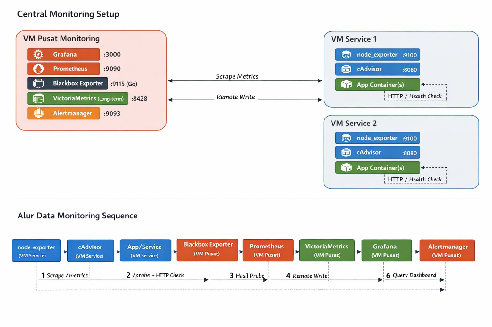

# Belajar Monitoring (Prometheus + VictoriaMetrics + Grafana + Blackbox)

Repository ini berisi setup monitoring terpusat dan service VM untuk observability host, container, serta SLA endpoint.

## Diagram Arsitektur



## Struktur Utama

- `monitoring/` → stack central monitoring (Prometheus, VictoriaMetrics, Grafana, Blackbox, Alertmanager)
- `service/` → stack agent di VM service (node_exporter, cAdvisor)
- `easy-script/` → script bootstrap otomatis untuk central dan service VM

## Prasyarat

- Docker + Docker Compose plugin (`docker compose`)
- Akses network antara VM central monitoring dan VM service
- Port yang dibuka sesuai kebutuhan:
  - Grafana `3000`
  - Prometheus `9090`
  - Alertmanager `9093`
  - VictoriaMetrics `8428`
  - Blackbox `9115`
  - node_exporter target `9100`
  - cAdvisor target `8080`

## 1) Jalankan Stack Service (di tiap VM service)

Masuk ke folder `service/` lalu jalankan:

```bash
docker compose up -d
```

Verifikasi:

```bash
docker ps
```

Pastikan `node_exporter` dan `cadvisor` berjalan.

## 2) Konfigurasi Target Scrape di Prometheus

Edit file `monitoring/prometheus/prometheus.yml`:

- `job_name: "node_exporter"` → isi IP:port VM service (contoh `10.1.101.102:9100`)
- `job_name: "cadvisor_services"` → isi IP:port VM service (contoh `10.1.101.102:8080`)
- `job_name: "blackbox_http"` → isi URL endpoint yang akan diukur SLA
- `job_name: "blackbox_tcp"` → isi target TCP jika diperlukan

Jika ingin ubah threshold latency SLA, edit rule di:

- `monitoring/prometheus/rules/sla_blackbox.yml`
- `monitoring/prometheus/rules/alerts_blackbox.yml`

Nilai default threshold saat ini adalah `0.30` detik (300ms).

## 3) Jalankan Stack Monitoring Central

Masuk ke folder `monitoring/` lalu jalankan:

```bash
docker compose up -d
```

Verifikasi:

```bash
docker compose ps
```

## 4) Akses UI dan Endpoint

- Grafana: `http://<IP-CENTRAL>:3000`
  - Username: `admin`
  - Password default: `admin123!` (segera ganti)
- Prometheus: `http://<IP-CENTRAL>:9090`
- Alertmanager: `http://<IP-CENTRAL>:9093`
- VictoriaMetrics: `http://<IP-CENTRAL>:8428`

Grafana sudah diprovision dengan datasource:

- `Prometheus-Local`
- `VictoriaMetrics-LongTerm`

Dashboard JSON tersedia di:

- `monitoring/grafana/dashboards/monitoring-unified.json`
- `monitoring/grafana/dashboards/sla_blackbox.json`

## 5) Cek Cepat Setelah Deploy

Di Prometheus (`/graph`), cek query berikut:

- `up{job="node_exporter"}`
- `up{job="cadvisor_services"}`
- `probe_success{job="blackbox_http"}`
- `sla:probe_24h_percent`

Kalau metrik muncul dan bernilai sesuai ekspektasi, pipeline monitoring sudah aktif.

## Opsi Setup Otomatis (Script)

Jika ingin bootstrap via script:

- Central monitoring: `easy-script/setup-monitoring-central.sh`
- Service VM: `easy-script/setup-service-vm.sh`

> Catatan: script dibuat untuk environment Linux dan path tertentu sesuai isi script.
